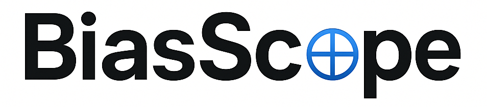

<div align="center">
  
</div>

# bias-scope

**A comprehensive Python library for detecting and measuring biases in machine learning models.**

bias-scope provides a unified API for evaluating bias across four methodological categories: embedding-based tests, probability-based metrics, generated text analysis, and prompt-based evaluations. It supports virtually any model accessible via HuggingFace Transformers or LiteLLM-compatible APIs.

## Install

Core install:

```bash
pip install bias-scope
```

Optional extras:

```bash
pip install "bias-scope[torch]"
pip install "bias-scope[embeddings]"
pip install "bias-scope[datasets]"
pip install "bias-scope[llm]"
pip install "bias-scope[all]"
```

Or from source:

```bash
pip install git+https://github.com/RAINLabLAU/bias_scope.git
```

## Quick Example

```python
from sentence_transformers import SentenceTransformer
from bias_scope.embeddings_based import WEAT

model = SentenceTransformer("all-MiniLM-L6-v2")

male_emb = model.encode(["John", "Paul", "Mike", "Kevin"])
female_emb = model.encode(["Amy", "Joan", "Lisa", "Sarah"])
career_emb = model.encode(["executive", "management", "salary", "career"])
family_emb = model.encode(["home", "children", "marriage", "family"])

weat = WEAT()
score = weat.evaluate(
    target_embeddings=(male_emb, female_emb),
    attribute_embeddings=(career_emb, family_emb),
)
print(f"WEAT effect size: {score:.4f}")
```

## Metric Categories

| Category                                               | Metrics | Description                                              |
| ------------------------------------------------------ | ------- | -------------------------------------------------------- |
| [Embedding-Based](api/overview.md#embedding-based)     | 4       | WEAT, SEAT, CEAT, SentenceBiasScore                      |
| [Probability-Based](api/overview.md#probability-based) | 9       | CrowS-Pairs, CAT, iCAT, AUL, AULA, LMB, LPBS, CBS, DisCo |
| [Generated Text](api/overview.md#generated-text-based) | 17      | RegardScore, ScoreParity, ToxicityFraction, and more     |
| [Prompt-Based](api/overview.md#prompt-based)           | 11      | BBQ, StereoSet, TruthfulQA, BOLD, and more               |
